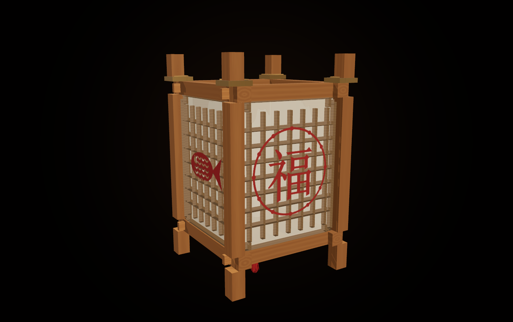

<div align="center">


# 榫卯灯笼 · 国风流光

**十三根木条，一颗钉子也不用。**

打开网页，从十三根方料开始，一刀一刀开榫凿卯，<br />
把一盏能拆开的中式灯笼做出来，再点亮它。

### [打开就玩 →](https://sunmao.vercel.app)

约 8 分钟 · 不用注册 · 不用下载 · 手机也能玩

[这是什么](#这是什么) · [自己做一遍](#自己做一遍) · [怎么做的](#怎么做的) · [怎么操作](#怎么操作) · [跑起来](#跑起来) · [文档](#文档)

</div>

---

## 这是什么

一节能动手做的木工课，跑在网页里，面向**十岁往上的孩子和陪着他们的大人**。

课本上的榫卯是一张剖面图，博物馆里的榫卯是一件不许摸的展品，都说不清**木头为什么能这样咬住木头**。
这里的办法是让你自己做一遍：十八步四幕，每一步都能亲手拖、亲手锯，每一道槽都是当场从毛坯上减出来的。

| 幕 | 步 | 在做什么 |
|---|---|---|
| **开场** | A1–A2 | 一盏灯，为一年收尾 —— 不用钉子，它凭什么立得住 |
| **认识榫卯** | B1–B3 | 凸的叫榫，凹的叫卯。直榫穿过去，夹榫落下来 |
| **做骨架** | C1–C8 | 开槽、切榫、凿透眼、凿柱窝、削细颈，十三根木条合龙 |
| **装点年味** | D1–D5 | 选花纹、装格心、糊纸贴花，最后拆开看一遍 |

<div align="center">

</div>

十八步走完就是它。灯还没点，木作看得最清楚：四角出头的榫、四面镂空的棂条、糊在里面的绵纸。

做完之后还有四件事：**点灯**（按住不放，把灯点亮）、**猜灯谜**（答对一个，灯亮一分）、
**写心愿**（写一句话，存成一张海报）、**挂起来**（挂到夜色里，最多六盏）。

---

## 自己做一遍

<div align="center">


</div>

**加工是过程，不是一段动画。** 凿子压在哪条槽上，就只有那条槽在掉料；刀走到哪儿，料才少到哪儿。
横枨两头各一个透眼，隔着大半根料，第一个凿穿了，第二个也得等刀真的走过去才开始掉料。手往回拖，木头不会长回去。

**拆开看，五层三十六件。** 底盘 5、上面的框 4、立柱 4、格心与纸 12、装饰与灯芯 11。
可以单看某一层，也可以拉着滑块把整盏灯慢慢摊开。

**不拦人。** 任何一步都能直接翻过去。需要动手的地方旁边一直留着「帮我加工」「帮我装上」——
走同一段动画、同一组音效，跳过的只是手感。

**跟不上的人也有路。** 旁白按 3.3–4 字／秒配速，单行不超过约三十字；生僻词带注音（「榫卯，sǔn mǎo」「枨，chéng」）；
灯谜答错不扣分、不重来，也不用红色。

---

## 怎么做的

无框架、无后端：一个 [three.js](https://threejs.org) 依赖，一份 Vite 配置，产物是纯静态文件。
下面五件事是这一版的主要做法，实现说明见 [DESIGN.md](DESIGN.md)。

**几何是算出来的。** 基本模数 a = 12 mm，最小刻度 1 mm，不是整数毫米就当场抛错。
十三件木构件由「毛坯盒减去若干带工序标签的切除盒」生成，每一道工序都是一次精确的布尔减法。
于是三件事顺带成立：加工感不用画（CSG 标出哪些面是新切出来的，着色器据此提亮一档）、
穿模可以证伪（十七件两两求交，重叠体积全为 0）、面数压得住（包络合计 1152 个三角形）。

**料是跟着刀走的。** 刀每动一下，「刀在哪、走了多少」就直接喂给 CSG，现算这一刀啃掉的那一块。
判定分三层：哪一条道、啃到多深、走到哪儿 —— 前面那两个透眼靠的正是第三层。工具只有锯、凿、刨三样。

**取景是算出来的。** 每一步只声明「必须完整看到多大一块」，相机自己算该退到多远 ——
界面占掉的画面、伸在工件之外的刀身，都一并算进去。

**音效是实时合成的。** 二十记声音全部由 WebAudio 按物理模型现场算 ——
只有木头、纸、火三类来源，界面自己只留三记。

**纹样是程序化的。** 万字纹与麻叶纹都由一组「二维线段 + 线宽」生成，再挤出成真实的镂空棂条。
同一份线段数据同时供给灯上的棂条、地面的光斑、海报的脚线与选纹样的缩略图 —— 你选的纹样，四处永远是同一个。
首图里地上那片光斑不是贴图，是格心当聚光灯遮罩烘出来的。

---

## 怎么操作

第一次进来会先讲一遍，右上角常留一个完整版。

| | |
|---|---|
| 两侧箭头 · `←` `→` | 上一步、下一步 |
| `空格` | 下一步 |
| 顶部小格 | 点一下跳到那一步；键盘走到哪一格就报哪一步 |
| 拖动 · 滚轮 | 转动、缩放。转到哪儿就停在哪儿，镜头不会自己跑回去 |
| `X` | 没有卷或坞挡着时，把灯笼拆开、调透明 |
| `Esc` | 收起菜单与大多数覆盖层；互动模块用左上角那枚返回 |

需要动手的步骤，底部中央会出现一个按钮；构件直接拖就行，每一次装配都只有一个合法方向 ——
呼吸的小箭头会指出来是哪个方向，推歪了会阻尼回弹，并说出这一步为什么只能那样推
（「柱子不能从上往下放 —— 沿着箭头，从外面横着推」）。

界面默认浅色，右上角可以切到深色。夜里的那几步界面会自动跟着变暗，但不动你存下的选择（[为什么](UI.md#主题)）。

窄屏与手机横屏各有一套布局：翻页挪到底部两角，屏幕两侧整片让给手指转动画面。

<div align="center">

</div>

---

## 跑起来

```bash
npm install
npm run dev
```

打开 <http://localhost:5173>。

```bash
npm run build      # 静态产物 → dist/
npm run lint       # ESLint
npm test           # 单元断言：模数守卫、CSG 内核、补间取消语义（node:test，无依赖）
npm run verify     # 几何闭合验算（Node 端，无需浏览器）
npm run size       # 产物体积门槛
npm run smoke      # 冒烟测试：真实浏览器走完十八步 + 四个模块
npm run check:code # 上面除冒烟外的五样（不进浏览器，一分钟以内）
npm run check      # check:code + smoke
```

`npm run smoke` 与 `npm run shots` 需要一次性装好浏览器内核：

```bash
npx playwright install chromium
```

冒烟测试的覆盖面见 [DESIGN.md](DESIGN.md#12-验收)，CI 上两条作业各管一半、分开的理由见
[ARCHITECTURE.md](docs/ARCHITECTURE.md#检查)。

README 里的五张图与《旁白解说稿》都是生成的，改了模型、界面或旁白之后重出一遍：

```bash
npm run shots      # 从构建产物里重拍五张图
npm run script     # 从源码导出旁白 → 旁白解说稿.md
```

纯静态产物，任何静态托管都能放，搁在子路径下（如 GitHub Pages 的 `/repo/`）也不用改配置。
当前 Demo 在 Vercel：`npm run build && npx vercel deploy --prod`。

**环境**：Node 22.13+ 或 24+（`package.json` 的 `engines`）。

浏览器需要 WebGL 2（three 0.185 的渲染器只申请 `webgl2` 上下文，没有降级）与 ES2022，
建议按 Chrome / Edge 111+、Safari 16.4+、Firefox 113+ 这条保守基线。
移动设备与低配机走减配档，各档的颜色完全一致。
上下文被系统回收时（移动端切后台常见）会等一次 `webglcontextrestored`，找回来就原地接着走。

---

## 项目结构

```
src/
  core/       modulus 模数体系 · boxcsg CSG 内核 · parts 构件参数 · verify 几何验算 · state 全局状态
  render/     stage 舞台与取景 · lantern 装配体 · materials · geometry · lattice 纹样 · decor · fx
  interact/   assembly 单自由度约束装配 · machining 拖刀加工
  audio/      sfx 模态合成音效 · voice 旁白字幕 · bgm 背景音乐
  ui/         hud 界面层 · icons · styles/{tokens,base,chrome,controls,surfaces}.css
  app/        engine 分步引擎
  steps/      act1 / act3 / act4 十八步主线 · util 步骤共用工具
  modules/    m1-m2 点灯与灯谜 · m3-m4 心愿与挂灯 · vo 模块旁白与片尾
  util/       tween 补间与调度
  main.js     唯一的装配处 · styles.css 样式入口
tools/        单元断言 · 几何验算 · 冒烟测试 · 体积门槛 · 重出截图 · 导出旁白
vite.config.js   构建配置、开发期两个中间件、生产 CSP 注入
```

模块边界与依赖方向见 [ARCHITECTURE.md](docs/ARCHITECTURE.md)。

构建产物 836 kB（gzip 228 kB），其中 three.js 单独一块 619 kB，其余全部代码加起来 217 kB。
`npm run size` 给 three、其余代码与 gzip 总量各设了上限，翻上去当场报。
产物里没有图片也没有字体：图标是内联 SVG 线稿，favicon 与那层纸纹是 data-URI SVG。

仓库同样不含音频文件，旁白与背景音乐留了挂载口；没有音频时，字幕按语速模型独立走完同一套内容（见 [DESIGN.md](DESIGN.md#9-音频)）。

---

## 隐私

没有埋点、没有 Cookie、没有第三方脚本，产物不向任何外部域名发请求。
本机只留界面偏好；进度、亮度、灯谜得分与写下的愿望都不落盘，下次打开一律从头开始。
写心愿没有输入框，愿望从现成的词里挑或拼，海报在设备本地用 Canvas 合成。

攻击面、CSP 与响应头配置见 [SECURITY.md](SECURITY.md)。

---

## 文档

- [ARCHITECTURE.md](docs/ARCHITECTURE.md) —— 模块边界、数据流、加一步要改哪几个文件
- [DESIGN.md](DESIGN.md) —— 几何、主线与三维交互的实现说明
- [UI.md](UI.md) —— 界面设计语言：主题、令牌、组件、文案规则
- [TROUBLESHOOTING.md](docs/TROUBLESHOOTING.md) —— 跑不起来、画面不对、测试挂了怎么查
- [旁白解说稿.md](旁白解说稿.md) —— 全片旁白，可直接交给配音

---

## 参与

修 bug、改拗口的文案、补无障碍与浏览器兼容 —— 这几类最有用，直接提 PR。
要加依赖、换框架、加新模块，先开个 Issue 聊。约定与本地要跑哪几条检查见 [CONTRIBUTING.md](CONTRIBUTING.md)。

发现安全问题走 [SECURITY.md](SECURITY.md) 的私密通道，不要开公开 Issue。参与讨论请遵守[行为准则](CODE_OF_CONDUCT.md)。

---

## 许可

双轨授权：**能跑的东西归 AGPL，念出来、写出来、画出来的东西归 CC。**

- **代码**（`src/`、`tools/`、`index.html`、构建与 CI 配置）—— [AGPL-3.0](LICENSE)
- **内容与素材**（课程编排、全部旁白与文案、`docs/img/` 的截图、纹样与装饰件设计）—— [CC BY-NC-SA 4.0](legal/CC-BY-NC-SA-4.0.txt)

AGPL 在这里具体怎么生效、什么时候需要一份单独的商业授权，见 [COMMERCIAL.md](COMMERCIAL.md)。

Copyright © 2026 MrBaoboer
