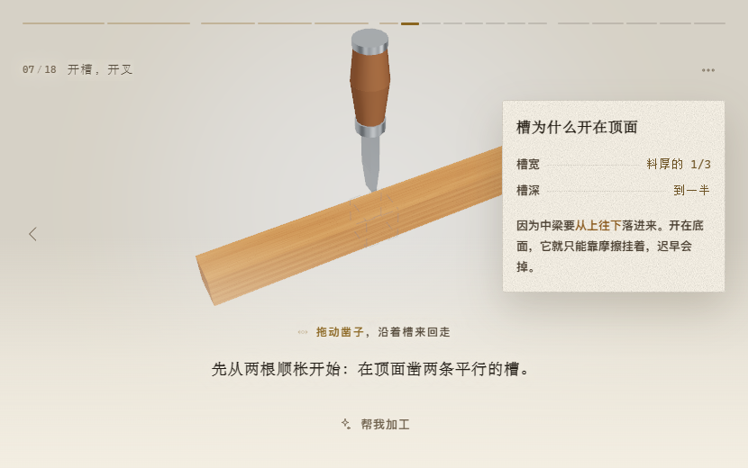

<div align="center">


# 榫卯灯笼 · 国风流光

**十三根木条，一颗钉子也不用。**

在浏览器里，从十三根方料开始，一刀一刀开榫凿卯，<br />
把一盏能拆开的中式灯笼做出来，再点亮它。

### [打开就玩 →](https://sunmao.vercel.app)

约 8 分钟 · 不用注册 · 不用下载 · 手机也能玩

</div>

---

## 这是什么

一节能动手做的木工课，跑在网页里。

面向**十岁往上的孩子和陪着他们的大人**。它想解决的是「榫卯」这个词的老问题：
课本上是一张剖面图，博物馆里是一件不许摸的展品，两头都不告诉你**为什么木头能这样咬住木头**。

这里的办法是让你自己做一遍。十八步，每一步都能亲手拖、亲手锯；
每一根木条的每一道槽，都是当场从毛坯上减出来的。

| | |
|---|---|
| **开场** | 一盏灯，为一年收尾 —— 不用钉子，它凭什么立得住 |
| **认识榫卯** | 凸的叫榫，凹的叫卯。直榫穿过去，夹榫落下来 |
| **做骨架** | 开槽、切榫、凿透眼、铣柱窝，十三根木条合龙 |
| **装点年味** | 选花纹、装格心、糊纸贴花，最后拆开看一遍 |

做完之后还有五件事：点灯、猜灯谜、写心愿、挂灯笼、放烟花。

<div align="center">


</div>

---

## 怎么做的

无框架、无后端、无构建期资源：一个 [three.js](https://threejs.org) 依赖，一份 Vite 配置，产物是纯静态文件。

- **几何是算出来的。** 基本模数 a = 12 mm，所有尺寸都是 a 或 a/12 的整数倍，整套几何跑在整数毫米栅格上。十三件木构件由「毛坯盒减去若干带工序标签的切除盒」生成 —— 铣槽、凿透眼、铣柱窝、切榫、开颈，每道工序都是一次精确的布尔减法。于是加工感不用画（CSG 标出哪些面是新切出来的，着色器据此提亮一档），穿模可以证伪（十七件两两求交，136 组配对重叠体积全为 0），面数也压得住（十七件包络合计 1152 个三角形）。
- **取景是算出来的。** 每一步只声明「必须完整看到多大一块」，相机自己算该退到多远：水平与垂直各算一次取远的那个，界面占掉的画面也一并算进去。同一份内容，1440×900 与 390×844 上都完整。
- **音效是实时合成的。** 因为它必须可参数化 ——「第二记高 2 个半音」「四根立柱到位音依次上行」，固定采样做不到。声音只有三类来源：木头、纸、火。
- **纹样是程序化的。** 格心的麻叶纹按传统组子的排法生成：方格划两条对角线分成四个三角，每个三角自三角各出一条棂条交于形心。同一份线段数据同时用于灯上的棂条、地面的光斑和海报的脚线。

`npm run verify` 会在 Node 端跑完 15 条几何断言；页面加载时也会跑一遍，右上角的「尺寸对照」可以随时调阅。

---

## 怎么操作

页面右上角有「怎么操作」，第一次进来也会先讲一遍。这里是完整版：

| | |
|---|---|
| 两侧箭头 · `←` `→` · `空格` | 上一步、下一步 |
| 顶部小格 | 点一下跳到那一步 |
| 拖动 · 滚轮 | 转动、缩放。松手三秒，镜头自己缓回推荐机位 |
| `X` | 随时把灯笼拆开、调透明 |
| `Esc` | 收起菜单或当前这一页 |

需要动手的步骤，底部中央会出现一个按钮；构件直接拖就行，每一次装配都只有一个合法方向。
不想自己动手，旁边一直有「帮我加工」「帮我装上」。

旁白没念完可以往前翻，任务没做完也可以往前翻。对一个自愿点进来的教学页面，「被拦住」的伤害远大于「少练一次」。

界面默认浅色，右上角可以切到深色。夜里的场景（做完灯之后的那几步）本来就该是暗的，界面会自动跟着变暗，不影响你的选择。

<div align="center">

</div>

---

## 跑起来

```bash
npm install
npm run dev
```

打开 <http://localhost:5173>。

```bash
npm run build     # 静态产物 → dist/
npm run verify    # 几何闭合验算（Node 端，无需浏览器）
npm run smoke     # 冒烟测试：真实浏览器走完十八步
npm run check     # 上面三样按顺序跑一遍
```

`npm run smoke` 需要一次性装好浏览器内核，之后不必再装：

```bash
npx playwright install chromium
```

它会用构建产物起一个静态服务，在 1440×900 与 390×844 两种画幅下走完全部十八步；
桌面画幅还会把加工、装配、快速翻页、点灯、海报合成、烟花各跑一遍最短路径。
沿途盯着控制台报错、资源 404、未捕获异常和相机异常，任何一条都判失败。
加 `--shots` 会把每一步截图写到 `.shots/smoke/`：

```bash
npm run smoke -- --shots
```

**环境**：Node 20.19+ 或 22.12+（Vite 7 的要求）。运行时只有一个依赖 [three.js](https://threejs.org)；
浏览器需要支持 WebGL 2 与 ES2022，即 Chrome / Edge 111+、Safari 16.4+、Firefox 113+。

---

## 部署

纯静态产物，任何静态托管都能放。当前 Demo 在 Vercel：

```bash
npm run build
npx vercel deploy --prod
```

`vite.config.js` 里 `base: './'`，产物用的是相对路径 —— 放在子路径下（如 GitHub Pages 的 `/repo/`）也不用改配置。

---

## 音频

旁白与背景音乐留了挂载口，用什么工具录制或生成都行：

- 旁白 → `public/audio/vo/{编号}.mp3`，在同目录 `manifest.json` 里登记 `{ "ids": [...] }`
- 音乐 → `public/audio/bgm/{曲名}.mp3`，同理登记 `{ "files": [...] }`

全片旁白见 [旁白解说稿.md](旁白解说稿.md)，已分段断句、标好语速与停顿，可直接交给配音。
仓库里不含音频文件；没有音频时字幕按语速模型独立走完同一套内容，一句不少。

音效不在此列 —— 它们是实时合成的，没有文件。

---

## 隐私

写心愿模块不采集任何个人信息：不要姓名手机号、不登录、不上传愿望内容。
海报在设备本地用 Canvas 合成，编号是本地生成的随机码，不含用户标识，也不可反查。
全站没有埋点，没有第三方脚本。

---

## 目录

```
src/
  core/       模数体系、CSG 内核、构件参数、几何验算、全局状态
  render/     舞台与取景、材质、格心纹样、装饰件、装配体、粒子特效
  interact/   单自由度约束装配、拖刀加工
  audio/      模态合成音效、旁白字幕、背景音乐
  ui/         界面层、图标、样式系统
  app/        分步引擎
  steps/      18 步主线内容
  modules/    五个互动模块与它们的旁白
tools/
  verify-geometry.mjs   几何闭合验算（Node）
  smoke.mjs             冒烟测试（无头浏览器）
  make-script.mjs       旁白解说稿排版
```

## 文档

- [ARCHITECTURE.md](docs/ARCHITECTURE.md) —— 模块边界、数据流、加一步要改哪几个文件
- [DESIGN.md](DESIGN.md) —— 几何、主线与三维交互的实现说明
- [UI.md](UI.md) —— 界面设计语言：主题、令牌、组件、文案规则
- [TROUBLESHOOTING.md](docs/TROUBLESHOOTING.md) —— 跑不起来、画面不对、测试挂了怎么查
- [旁白解说稿.md](旁白解说稿.md) —— 全片旁白，可直接交给配音
