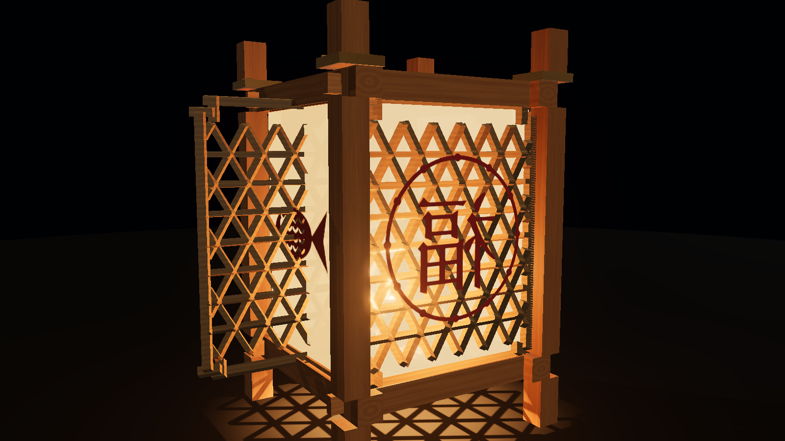
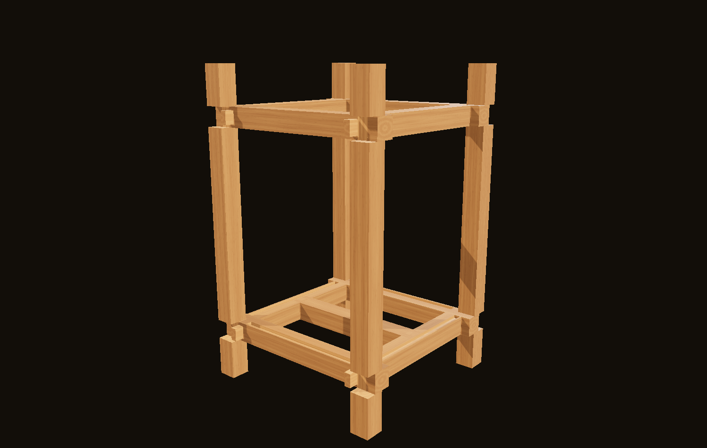
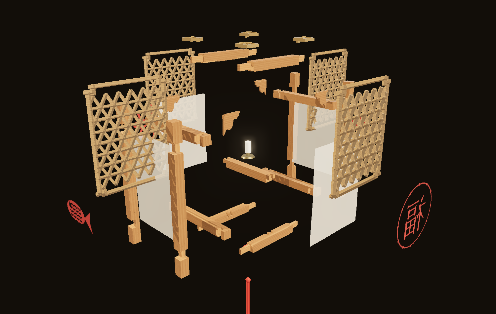

<div align="center">



# 榫卯灯笼 · 国风流光

**十三根木条，一颗钉子也不用。**

在浏览器里，从十三根方料开始，一刀一刀开榫凿卯，<br />
把一盏能拆开的中式灯笼做出来，再点亮它。

### [打开就玩 →](https://sunmao.vercel.app)

约 8 分钟 · 不用注册 · 不用下载

</div>

---

## 你会做出什么

主线十八步，分四章。每一步都能亲手做，也都能交给「帮我加工」。

| | |
|---|---|
| **开场** | 一盏灯，为一年收尾 —— 不用钉子，它凭什么立得住 |
| **认识榫卯** | 凸的叫榫，凹的叫卯。直榫穿过去，夹榫落下来 |
| **做骨架** | 开槽、切榫、凿透眼、铣柱窝，十三根木条合龙 |
| **装点年味** | 选花纹、装格心、糊纸贴花，最后拆开看一遍 |

做完之后还有五件事：点灯、猜灯谜、写心愿、挂灯笼、放烟花。

<div align="center">


</div>

---

## 三处不太一样的地方

### 几何是算出来的，不是建出来的

基本模数 a = 12 mm，所有尺寸都是 a 或 a/12 的整数倍 —— 整套几何跑在整数毫米栅格上，没有浮点误差。
十三件木构件由「毛坯盒减去若干带工序标签的切除盒」生成，铣槽、凿透眼、铣柱窝、切榫、开颈，每一道工序都是一次精确的布尔减法。

这样换来三件事：

- **加工感不用画。** CSG 内核会标出哪些面是加工新露出的，着色器据此把新切面提亮一档。
- **穿模可以证伪。** 十七件构件两两求交，当前 136 组配对的重叠体积全部为 0。
- **面数很低。** 一根开满槽的顺枨 86 个三角形，十七件包络体合计 1152 个。

`src/core/verify.js` 里有 15 条断言，页面加载时自动跑一遍；界面右上角的「尺寸对照」可以随时调阅。

### 音效是实时合成的，不是采样

因为它必须可参数化 ——「第二记音高高 2 个半音」「十三次落料随机 ±2 半音」「四根立柱到位音依次上行」，固定采样做不到。

声音只有三类来源：木头、纸、火。界面本身几乎不出声。

### 不拦人

旁白没念完可以往前翻，任务没做完也可以往前翻，顶部十八格点哪一格跳哪一步。
对一个自愿点进来的教学页面，「被拦住」的伤害远大于「少练一次」。

---

## 怎么操作

页面右上角有「怎么操作」，第一次进来也会先讲一遍。这里是完整版：

| | |
|---|---|
| 两侧箭头 · `←` `→` · `空格` | 上一步、下一步 |
| 顶部小格 | 点一下跳到那一步 |
| 拖动 · 滚轮 | 转动、缩放。松手三秒，镜头自己缓回推荐机位 |
| `X` | 随时把灯笼拆开、调透明 |
| `Esc` | 收起菜单或当前这一页 |

需要动手的步骤，底部中央会出现一个按钮；构件直接拖就行，每一次装配都只有一个合法方向。

界面默认浅色，右上角可以切到深色。傍晚与夜里的场景本来就该是暗的，那几步界面会自动跟着变暗，不影响你的选择。

---

## 跑起来

```bash
npm install
npm run dev
```

打开 <http://localhost:5173>。

```bash
npm run build     # 静态产物 → dist/
npm run verify    # 几何闭合验算（Node 端，无需浏览器）
```

只有一个运行时依赖：[three.js](https://threejs.org)。

---

## 音频

旁白与背景音乐留了挂载口，用什么工具录制或生成都行：

- 旁白 → `public/audio/vo/{编号}.mp3`，在同目录 `manifest.json` 里登记 `{ "ids": [...] }`
- 音乐 → `public/audio/bgm/{曲名}.mp3`，同理登记 `{ "files": [...] }`

全片旁白见 [旁白解说稿.md](旁白解说稿.md)，已分段断句、标好语速与停顿，可直接交给配音。
没有音频时，字幕按语速模型独立走完同一套内容。

---

## 隐私

写心愿模块不采集任何个人信息：不要姓名手机号、不登录、不上传愿望内容。
海报在设备本地用 Canvas 合成，编号是本地生成的随机码，不含用户标识，也不可反查。

---

## 目录

```
src/
  core/       模数体系、CSG 内核、构件参数、几何验算、全局状态
  render/     舞台、材质、格心纹样、装饰件、装配体、粒子特效
  interact/   单自由度约束装配、拖刀加工
  audio/      模态合成音效、旁白字幕、背景音乐
  ui/         界面层、图标、样式系统
  app/        分步引擎
  steps/      18 步主线内容
  modules/    五个互动模块与它们的旁白
tools/        几何验算（Node）、旁白解说稿生成
```

## 文档

- [UI.md](UI.md) —— 界面设计语言：主题、令牌、组件、文案规则
- [DESIGN.md](DESIGN.md) —— 几何、主线与交互的实现说明
- [旁白解说稿.md](旁白解说稿.md) —— 全片旁白，可直接交给配音
